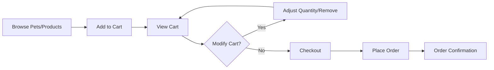

## 1. Product Overview
宠物店在线购物系统，为用户提供浏览宠物和商品、购物车管理及下单功能的一站式平台。
- 解决用户线下宠物店购物不便的问题，提供便捷的在线购物体验
- 目标用户：宠物爱好者、宠物主人

## 2. Core Features

### 2.1 User Roles
| Role | Registration Method | Core Permissions |
|------|---------------------|------------------|
| Normal User | Email registration | Browse pets/products, add to cart, place orders |

### 2.2 Feature Module
1. **Home page**: Hero section, category navigation, featured pets/products
2. **Pets page**: Pet listing, filtering, pet details
3. **Products page**: Product listing, filtering, product details
4. **Cart page**: Cart items management, quantity adjustment, checkout
5. **Orders page**: Order history, order details

### 2.3 Page Details
| Page Name | Module Name | Feature description |
|-----------|-------------|---------------------|
| Home page | Hero section | Banner carousel showing promotions |
| Home page | Category navigation | Quick access to pets and products |
| Home page | Featured section | Display popular pets and products |
| Pets page | Pet listing | Grid layout with filtering options |
| Pets page | Pet details | Detailed pet info, add to cart |
| Products page | Product listing | Grid layout with filtering options |
| Products page | Product details | Detailed product info, add to cart |
| Cart page | Cart items | Display items, adjust quantity, remove items |
| Cart page | Checkout | Calculate total, place order |
| Orders page | Order list | Display user's order history |
| Orders page | Order details | Show order items and status |

## 3. Core Process
User browses pets/products → Adds items to cart → Views cart → Adjusts quantities → Proceeds to checkout → Places order → Views order confirmation

## 4. User Interface Design
### 4.1 Design Style
- Primary color: Warm orange (#FF8C00) - represents warmth and friendliness
- Secondary color: Soft blue (#4A90D9) - represents trust and calm
- Button style: Rounded corners (8px), gradient hover effect
- Font: Playfair Display (heading), Open Sans (body)
- Layout style: Card-based design with clean white background
- Icon style: Modern, minimalist line icons

### 4.2 Page Design Overview
| Page Name | Module Name | UI Elements |
|-----------|-------------|-------------|
| Home page | Hero section | Full-width banner, carousel animation, call-to-action button |
| Home page | Category nav | Horizontal scrollable category cards with icons |
| Home page | Featured | Grid layout with pet/product cards, hover shadow effect |
| Pets/Products page | Listing | Filter sidebar, responsive grid, pagination |
| Cart page | Cart items | Card layout with product image, price, quantity selector |
| Cart page | Checkout | Sticky bottom bar with total and checkout button |
| Orders page | Order list | Timeline-style order cards, status badges |

### 4.3 Responsiveness
- Desktop-first approach with mobile-adaptive design
- Mobile: Single column layout, hamburger menu
- Tablet: 2-column grid for listings
- Desktop: 3-4 column grid for listings

### 4.4 3D Scene Guidance
Not applicable for this project.