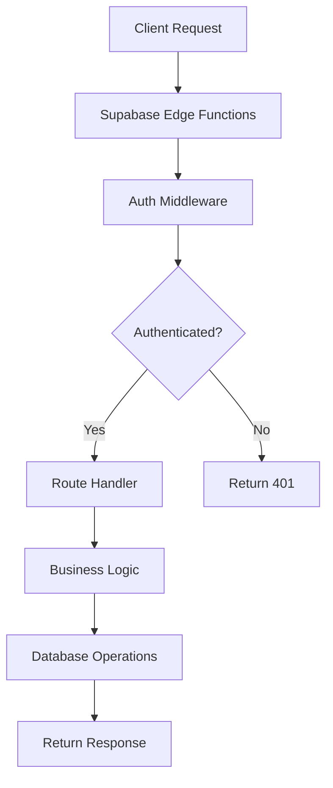
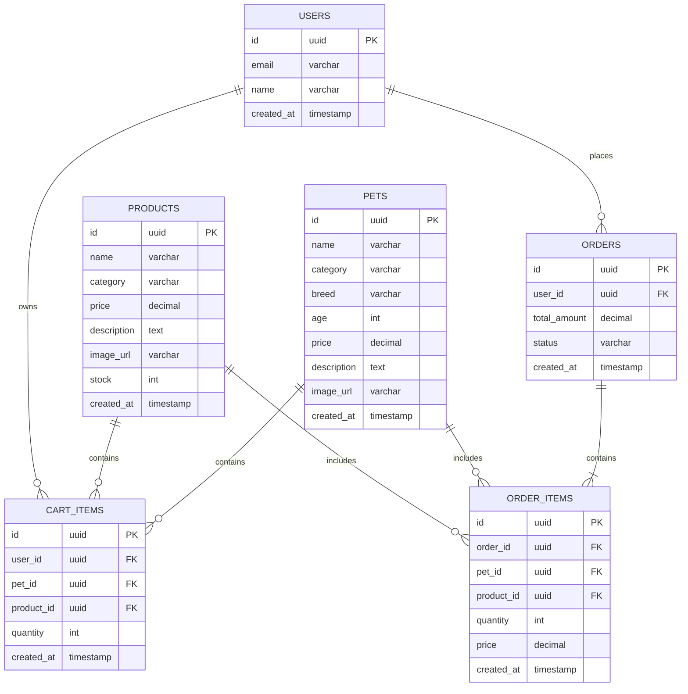

## 1. Architecture Design
```mermaid
layeredGraph LR
    subgraph Frontend
        A[React Components] --> B[Zustand Store]
        B --> C[Supabase Client]
    end
    
    subgraph Backend
        D[Supabase Auth]
        E[Supabase Database]
        F[Supabase Storage]
    end
    
    subgraph External Services
        G[Image CDN]
    end
    
    C --> D
    C --> E
    C --> F
    C --> G
```

## 2. Technology Description
- Frontend: React@18 + TypeScript + tailwindcss@3 + vite
- Initialization Tool: vite-init
- Backend: Supabase
- Database: Supabase (PostgreSQL)
- State Management: Zustand
- Routing: React Router DOM
- Icons: Lucide React

## 3. Route Definitions
| Route | Purpose | Component |
|-------|---------|-----------|
| / | Home page with hero and featured items | Home |
| /pets | Pet listing page with filtering | Pets |
| /pets/:id | Pet detail page | PetDetail |
| /products | Product listing page with filtering | Products |
| /products/:id | Product detail page | ProductDetail |
| /cart | Shopping cart page | Cart |
| /orders | Order history page | Orders |
| /orders/:id | Order detail page | OrderDetail |

## 4. API Definitions
### 4.1 Pet API
- GET /api/pets - Get all pets
- GET /api/pets/:id - Get pet by ID
- GET /api/pets?category=:category - Filter pets by category

### 4.2 Product API
- GET /api/products - Get all products
- GET /api/products/:id - Get product by ID
- GET /api/products?category=:category - Filter products by category

### 4.3 Cart API
- POST /api/cart - Add item to cart
- GET /api/cart - Get user's cart
- PUT /api/cart/:id - Update cart item quantity
- DELETE /api/cart/:id - Remove cart item

### 4.4 Order API
- POST /api/orders - Create order
- GET /api/orders - Get user's orders
- GET /api/orders/:id - Get order details

## 5. Server Architecture Diagram


## 6. Data Model
### 6.1 Data Model Definition


### 6.2 Data Definition Language
```sql
CREATE TABLE pets (
    id UUID PRIMARY KEY DEFAULT uuid_generate_v4(),
    name VARCHAR(100) NOT NULL,
    category VARCHAR(50) NOT NULL,
    breed VARCHAR(100),
    age INT,
    price DECIMAL(10,2) NOT NULL,
    description TEXT,
    image_url VARCHAR(255),
    created_at TIMESTAMP DEFAULT CURRENT_TIMESTAMP
);

CREATE TABLE products (
    id UUID PRIMARY KEY DEFAULT uuid_generate_v4(),
    name VARCHAR(100) NOT NULL,
    category VARCHAR(50) NOT NULL,
    price DECIMAL(10,2) NOT NULL,
    description TEXT,
    image_url VARCHAR(255),
    stock INT DEFAULT 0,
    created_at TIMESTAMP DEFAULT CURRENT_TIMESTAMP
);

CREATE TABLE users (
    id UUID PRIMARY KEY DEFAULT uuid_generate_v4(),
    email VARCHAR(255) UNIQUE NOT NULL,
    name VARCHAR(100),
    created_at TIMESTAMP DEFAULT CURRENT_TIMESTAMP
);

CREATE TABLE cart_items (
    id UUID PRIMARY KEY DEFAULT uuid_generate_v4(),
    user_id UUID REFERENCES users(id),
    pet_id UUID REFERENCES pets(id),
    product_id UUID REFERENCES products(id),
    quantity INT DEFAULT 1,
    created_at TIMESTAMP DEFAULT CURRENT_TIMESTAMP
);

CREATE TABLE orders (
    id UUID PRIMARY KEY DEFAULT uuid_generate_v4(),
    user_id UUID REFERENCES users(id),
    total_amount DECIMAL(10,2) NOT NULL,
    status VARCHAR(20) DEFAULT 'pending',
    created_at TIMESTAMP DEFAULT CURRENT_TIMESTAMP
);

CREATE TABLE order_items (
    id UUID PRIMARY KEY DEFAULT uuid_generate_v4(),
    order_id UUID REFERENCES orders(id),
    pet_id UUID REFERENCES pets(id),
    product_id UUID REFERENCES products(id),
    quantity INT NOT NULL,
    price DECIMAL(10,2) NOT NULL,
    created_at TIMESTAMP DEFAULT CURRENT_TIMESTAMP
);

GRANT SELECT ON pets TO anon;
GRANT SELECT ON products TO anon;
GRANT SELECT, INSERT, UPDATE, DELETE ON cart_items TO authenticated;
GRANT SELECT, INSERT ON orders TO authenticated;
GRANT SELECT, INSERT ON order_items TO authenticated;
```

### 6.3 Initial Data
```sql
INSERT INTO pets (name, category, breed, age, price, description, image_url) VALUES
('Buddy', 'Dog', 'Golden Retriever', 2, 2500.00, 'Friendly and loyal golden retriever puppy.', 'https://neeko-copilot.bytedance.net/api/text_to_image?prompt=cute%20golden%20retriever%20puppy&image_size=square'),
('Mittens', 'Cat', 'Persian', 1, 1800.00, 'Fluffy Persian cat with beautiful eyes.', 'https://neeko-copilot.bytedance.net/api/text_to_image?prompt=fluffy%20persian%20cat&image_size=square'),
('Charlie', 'Bird', 'Parrot', 3, 800.00, 'Colorful talking parrot.', 'https://neeko-copilot.bytedance.net/api/text_to_image?prompt=colorful%20talking%20parrot&image_size=square'),
('Nemo', 'Fish', 'Clownfish', 1, 150.00, 'Orange and white clownfish.', 'https://neeko-copilot.bytedance.net/api/text_to_image?prompt=clownfish%20swimming&image_size=square');

INSERT INTO products (name, category, price, description, image_url, stock) VALUES
('Premium Dog Food', 'Food', 89.00, 'High-quality dog food with real meat.', 'https://neeko-copilot.bytedance.net/api/text_to_image?prompt=premium%20dog%20food%20bag&image_size=square', 100),
('Cat Litter', 'Supplies', 29.00, 'Clumping cat litter, lavender scented.', 'https://neeko-copilot.bytedance.net/api/text_to_image?prompt=cat%20litter%20box&image_size=square', 50),
('Pet Bed', 'Furniture', 129.00, 'Comfortable orthopedic pet bed.', 'https://neeko-copilot.bytedance.net/api/text_to_image?prompt=comfortable%20pet%20bed&image_size=square', 30),
('Leash & Collar Set', 'Accessories', 45.00, 'Stylish leash and collar set.', 'https://neeko-copilot.bytedance.net/api/text_to_image?prompt=dog%20leash%20collar%20set&image_size=square', 80);
```